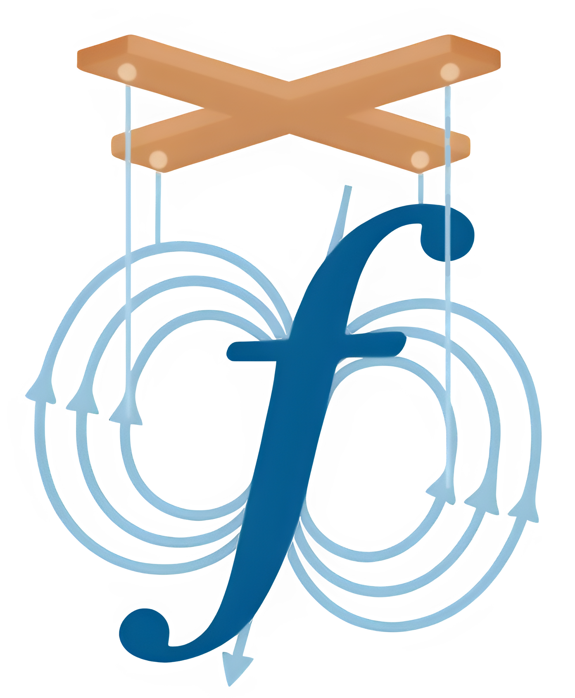

<p align="center">
  
</p>

# Flux Fiction

Flux Fiction is a trace-driven emulator for experimenting with Flux scheduling
policies without touching a production system. It plugs into real Flux and
Fluxion components, submits emulated jobs, tracks their lifecycle, and writes
artifacts that help you study scheduling behavior, resource use, and timing.

## What It Does

- Replays historical or synthetic workloads against a real Flux instance.
- Uses a native jobtap plugin to emulate job execution and timing.
- Produces run directories with logs, transition tables, resource timelines,
  utilization plots, and trace-style outputs.
- Supports optional faketime-driven simulation control and OpenTelemetry
  profiling.

## Quickstart

Flux Fiction is intended to be run inside of a containerized environment. It can be configured to run outside of a container, but this guide will show you how to set it up with a Podman container. The recommended setup is a shared workspace with sibling checkouts:

```text
<workspace>/
  flux-core/
  flux-sched/
  flux-fiction/
```

### 1. Build The Dev Image

```bash
cd flux-fiction/podman_containers
./build_container.sh flux-fiction-dev
```

### 2. Start The Container

From the workspace parent directory:

```bash
podman run --rm -it -v "$(pwd)":/workspace flux-fiction-dev
```

### 3. Build And Install Inside The Container

```bash
source /usr/local/bin/flux-dev-env.sh
/usr/local/bin/build-flux-core.sh
/usr/local/bin/build-flux-sched.sh
/usr/local/bin/build-flux-fiction.sh
```

This gives you an editable install of `flux-fiction` and the main CLI commands:

- `flux-fiction`
- `flux-fiction-run`
- `flux-fiction-jobtap-path`

### 4. Run A Smoke Test

```bash
cd /workspace/flux-fiction
flux-fiction-run test/simple_test/config.toml --tag smoke --no-faketime
```

### 5. Run Tests

```bash
cd /workspace/flux-fiction
pytest -q
```

## Main Commands

Use the base CLI when you already have a config and environment prepared:

```bash
flux-fiction --config_file /path/to/config.toml
```

Use the harness when you want Flux Fiction to prepare a run directory, copy
config inputs, wire faketime, and launch a fresh Flux instance:

```bash
flux-fiction-run /path/to/config.toml
```

Locate the built or installed jobtap plugin:

```bash
flux-fiction-jobtap-path
```

## Dependencies

### Runtime Dependencies

Flux Fiction itself has a fairly small direct dependency surface:

- `flux-core`
  Needed for the Flux Python bindings, Flux RPCs, and the native jobtap plugin
  interface.
- Python packages:
  - `pydantic`
  - `tqdm`

Optional Python extras:

- `plot`
  - `matplotlib`
- `otel`
  - `opentelemetry-api`
  - `opentelemetry-sdk`
  - `opentelemetry-exporter-otlp-proto-http`

### Jobtap Plugin Build Dependencies

If you are building the native `emu-jobtap.so` plugin, Flux Fiction also needs:

- `flux-core` headers and libraries
- `jansson`
- `meson`
- `ninja`
- `pkg-config`
- a C toolchain such as `gcc`

### Build Notes

- `flux-sched` is not a hard dependency of Flux Fiction itself.
  It is used in the recommended dev environment because it provides a scheduler
  that already works with the emulator, but Flux Fiction can run against other
  Flux schedulers.
- Podman is not a runtime dependency of Flux Fiction.
  It is just the recommended reproducible development environment for this repo.

## Scheduler Integration: `sched.quiescent`

Flux Fiction’s emulator advances in discrete timesteps. After it submits jobs
or processes completions for a step, it needs to know when the scheduler has
finished reacting to that work before it is safe to advance the simulation.

This is why the jobtap plugin probes the scheduler with the Flux RPC
`sched.quiescent`.

### Why It Is Needed

- It gives the emulator a synchronization point between simulation timesteps.
- It prevents the simulator from advancing while scheduler-side allocation work
  is still in flight.
- When start acknowledgements are batched, it helps the jobtap decide how many
  newly allocated jobs need to be flushed into `start` acknowledgements for the
  current step.

Without this RPC, the emulator can observe an inconsistent state where Flux has
accepted jobs, but the scheduler has not yet finished producing allocation/start
side effects for that timestep.

### What Flux Fiction Expects

The jobtap sends:

- RPC name: `sched.quiescent`
- Request payload: `null`

It expects a JSON response payload containing at least:

```json
{
  "status": 0,
  "alloc_current": 3
}
```

Meaning:

- `status`
  `0` means the scheduler is quiescent and the probe succeeded.
  Any nonzero value is treated as not quiescent or failed.
- `alloc_current`
  The number of currently allocated/running jobs visible to the scheduler at
  the moment of the quiescence response.

Flux Fiction’s jobtap uses `alloc_current` together with its own start/finish
watermarks to infer how many new allocations were created in the current step.

### Implementing It In Your Own Scheduler

If you want to use a scheduler other than Fluxion, the main requirement is to
provide a `sched.quiescent` RPC that:

1. Waits until the scheduler has drained any work triggered by the current
   batch of submissions or completions.
2. Returns `status = 0` only when that quiescent point has been reached.
3. Reports `alloc_current` as the scheduler’s current count of allocated/running
   jobs.

In practice, that usually means the handler should answer only after:

- pending enqueue/dequeue work is complete
- any allocation decisions for the current burst have been applied
- the scheduler’s internal view of running allocations is stable

## Local Python Install

If you already have Flux and the native build dependencies available on your
system, you can install directly from the repo.

### Development Install

```bash
python3 -m pip install -e '.[dev]'
```

### Install With Plotting And OTel Extras

```bash
python3 -m pip install -e '.[dev,plot,otel]'
```

## Native Build

Flux Fiction uses Meson for the native `emu-jobtap.so` build.

### Direct Meson Build

```bash
meson setup builddir
meson compile -C builddir
meson install -C builddir
```

### Point Meson At A Flux Install

```bash
meson setup builddir -Dflux_prefix=/path/to/flux-core
```

In the shared Podman workspace used by this project, Meson will also
automatically try:

- `../container-installs/flux-core`
- `../flux-core`

## Outputs

A typical run directory contains artifacts like:

- `run.log`
- `broker.log`
- `emu.log`
- `job_transitions.csv`
- `eventlog.csv`
- `resource_usage_timeseries.csv`
- `resource_allocations.csv`
- `resource_utilization.png` or `resource_utilization.svg`
- `pernode.json`

## Profiling

OpenTelemetry profiling is supported through `flux-fiction-run --otel`.

Example:

```bash
cd /workspace/flux-fiction
flux-fiction-run \
  test/rabbit_storage_test/config_queue20_otel_debug.toml \
  --otel \
  --otel-service-name rabbit-tuolumne-profile \
  --tag queue20-otel
```

Important notes:

- A live OTLP collector is optional for local profiling.
- Local profiling artifacts are still written even if `127.0.0.1:4318` is not
  available.
- Common local outputs include `otel_spans.jsonl`, `otel_bridge.log`, and
  sometimes `otel_summary.csv`.

## Repository Notes

- `util/run_ff.py` remains as a source-tree compatibility wrapper around the
  installed `flux-fiction-run` harness.
- `load_jobtap.sh` will load the local build artifact or the installed plugin
  path helper.
- The preferred development path is the Podman container because it keeps Flux,
  scheduler, Python, and native dependencies aligned.

## Auspices

This work was supported by the LLNL-LDRD Program under Project No. 24-SI-005.

## Reference

Please use this bibtex to reference the project:

```bibtex
@inproceedings{HPDCFluxEmulatorPoster,
  author    = {W. Jay Ashworth and Ian Lumsden and Jim Garlick and Mark Grondona and Olga Pearce and Stephanie Brink and Daniel Milroy and Tapasya Patki and Tom Scogland and Michela Taufer},
  title     = {{Poster: Flux Fiction: Hopping Toward Storage Graph Scheduling With El Capitan’s Rabbits}},
  booktitle = {Proceedings of the International ACM Symposium on High-Performance Parallel and Distributed Computing (HPDC)},
  year      = {2026},
  month     = {July},
  address   = {Cleveland, OH, USA},
  note      = {Poster Presentation}
}
```

## License

SPDX-License-Identifier: LGPL-3.0

LLNL-CODE-764420
